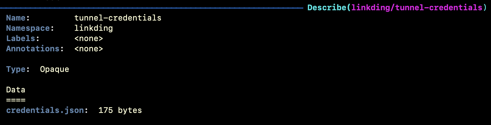
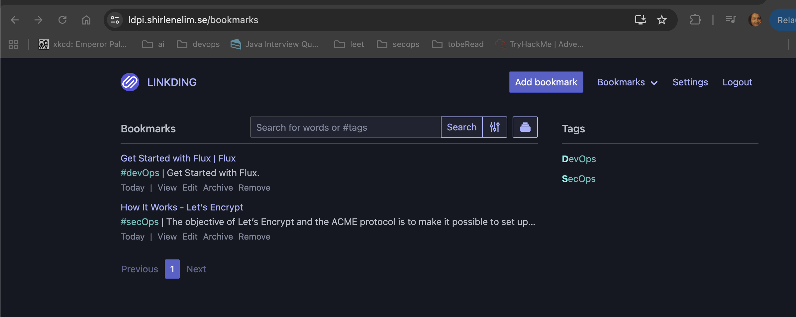

# Setup flux system for kubernetes
1. added linkding deployments

2. added pvc, make sure storageClass is supported by the ctx/provider 
3. claim the pvc through app/linkding/deployment
4. secure app by not using root user
5. cloudflare dns add a CNAME ldpi 
6. after creating cloudflared tunnel secrets manually
7. add cloudflare deployment and add configmap to contain secrets
 - although we're gonna encrypt this value later (base64) 

8. we see cloudflare deployments - 2 replicates

9. with cloudflare deployments matching the host to the kubernetes pods, we can browse to it 

10. currently I'm portforwarding 9090 in k9s for linkding, if later I'm not using this dynamically, I'll add a fixed yaml. 